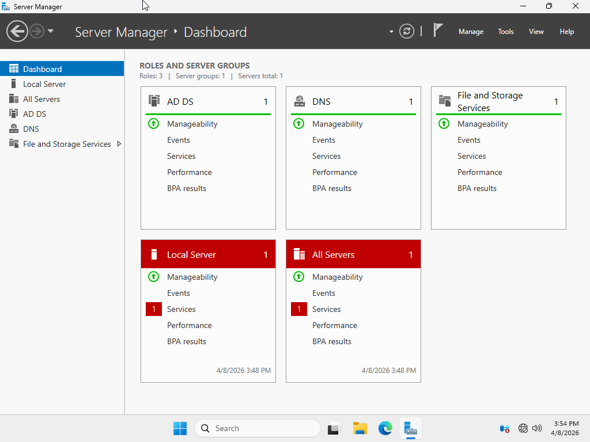
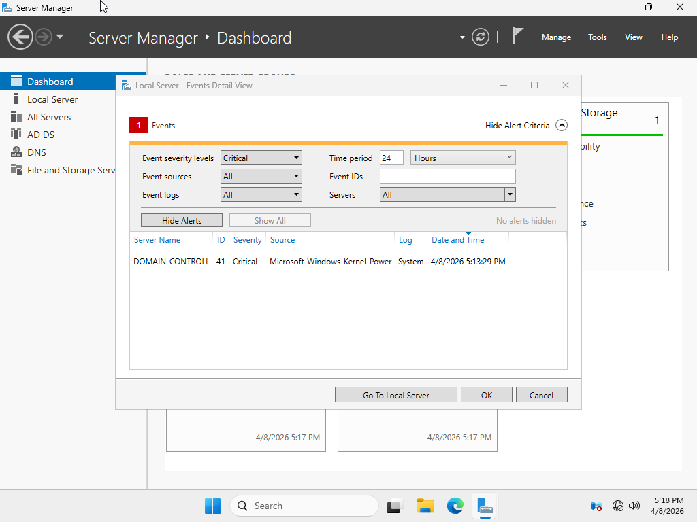

# Windows Support Home Lab

A Windows Server 2025 and Windows 11 Pro domain environment built from scratch
in VirtualBox to practice the core skills used in IT help desk work.

## What I Built

A small Active Directory domain (helpdesk.lab) running on a Windows Server 2025
domain controller, with a Windows 11 Pro client joined to the domain. The
server handles AD, DNS, and file sharing. The client authenticates to the
domain, accesses shared resources, and has restrictions applied via Group
Policy.

## Lab Setup

| Machine | Role | OS | IP |
|---------|------|-----|-----|
| DC-01 | Domain Controller, DNS, File Server | Windows Server 2025 | 10.0.0.10 |
| WS-01 | Domain-joined client | Windows 11 Pro | 10.0.0.20 |

**Domain:** helpdesk.lab
**Hypervisor:** Oracle VirtualBox
**Network:** VirtualBox Internal Network (isolated from host)

## Skills Practiced

- Active Directory Domain Services: installed AD DS, promoted server to domain controller, created forest
- User and group management: created OUs, users, security groups, and managed group membership
- DNS: configured forward lookup zones and troubleshot name resolution issues
- Group Policy: created GPOs to enforce desktop settings, drive mappings, and restrict standard user access
- File sharing: configured shared folders with NTFS and share permissions using least-privilege principles
- Windows 11 domain join and troubleshooting
- PowerShell basics for user account management and AD queries
- Network troubleshooting using ipconfig, ping, nslookup, and Test-NetConnection
- Remote Desktop configuration for remote support scenarios
- Event Viewer log analysis for authentication and system issues

## Screenshots

See the [screenshots/](screenshots/) folder for visual documentation of the
lab including Server Manager, Active Directory Users and Computers, the DNS
console, the domain login screen, NTFS permissions, and applied Group Policy
results.

## Troubleshooting

During the build, I encountered and resolved several issues. The most
notable ones are documented in [troubleshooting.md](troubleshooting.md),
including a domain join failure caused by incorrect DNS settings on the
client and a Group Policy that would not apply until the user logged off
and back on.

## Why I Built This

I built this lab to get hands-on experience with the technologies I'll be
supporting in an entry-level help desk role. Reading about Active Directory
is one thing; actually creating users, resetting passwords, unlocking
accounts, and troubleshooting a failed domain join is another. The lab
lets me practice real scenarios in a safe environment.

Note: The errors creating the red Local Server and All Servers tiles in the Server Manager image is caused by a known cosmetic SAM/KDC event on Windows Server 2025. The domain controller is fully functional — verified with dcdiag and successful domain logins from WS-01.

